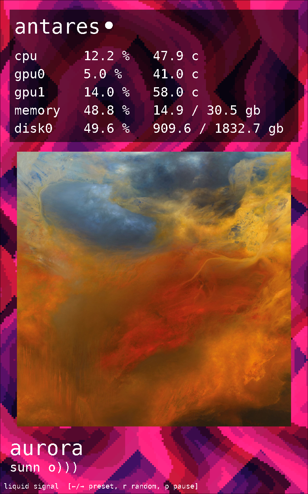

# PPISS

ABSOLUTELY VIBECODED <3



A generative, retro-styled PC status display for a Raspberry Pi Zero W and a portrait HDMI screen.
Its original low-resolution patterns use layered palette cycling, scrolling, and sinusoidal scanline
distortion inspired by techniques used in 16-bit-era battle backgrounds. It contains no game assets.
PC statistics are drawn as a stable, monospace terminal table over the animation.

```text
Linux PC -> UDP over USB Ethernet -> Raspberry Pi -> HDMI
```

## Pi

Install Raspberry Pi OS Lite, enable SSH, then run:

```sh
curl -fsSL https://raw.githubusercontent.com/EMajesty/ppiss/main/deploy/install-pi.sh | sudo sh
sudo reboot
```

The installer configures direct DRM/KMS rendering, USB Ethernet, and a system service. It defaults
to the 1280×800 test display rotated 90 degrees. Override the mode with `PPISS_VIDEO_MODE`, or set it
to an empty string to use EDID without rotation.

Connect the PC to the Pi Zero's USB **data** port. The Pi uses `10.55.0.2` and UDP port `45891`.

## PC

Add the repository to your Nix flake:

```nix
inputs.ppiss.url = "github:EMajesty/ppiss";
inputs.ppiss.inputs.nixpkgs.follows = "nixpkgs";
```

Import and configure it in Home Manager:

```nix
{ inputs, ... }:
{
  imports = [ inputs.ppiss.homeManagerModules.ppiss ];

  services.ppiss = {
    enable = true;
    host = "10.55.0.2";
  };
}
```

This installs and starts the Linux telemetry sender as a systemd user service.

## Development

```sh
direnv allow
./scripts/run-demo.sh
```

Without direnv, run `nix develop` first.
The script starts both the windowed display and a local telemetry sender, then stops the sender when
the display closes. Additional arguments are passed to the display.

Run tests with `python -m unittest discover -s tests`.

## Status

CPU, memory, temperature, and multi-GPU telemetry are implemented. NVIDIA uses `nvidia-smi`; AMD,
Intel, and other DRM devices use the metrics exposed by their kernel driver. Missing driver metrics
are omitted.

Spotify and other MPRIS players are detected through Playerctl, with direct MPD as a fallback.
While music is playing, metadata and album art appear on the Pi. Artwork is cached and served by the
PC on TCP port `45892`. Telemetry is unauthenticated and intended for the dedicated USB network.
